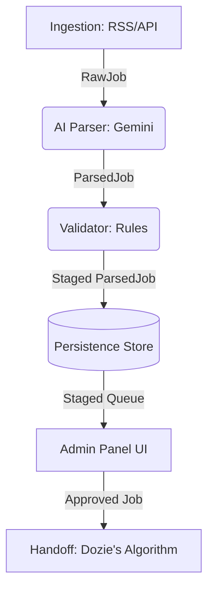

# Automated Job Data Pipeline (ScuibJobsAi Backend)

This is a decoupled, modular job data pipeline designed for job-matching products. The backend manages ingestion, AI-driven parsing, human-in-the-loop approval, and structured handoff to downstream algorithms.

---

## Architecture Overview

The pipeline is fully modular, adhering strictly to abstract interfaces defined in Python's ABC system. Implementation selection is resolved at startup via FastAPI's Dependency Injection system in [dependencies.py](file:///c:/Users/HomePC/Downloads/pipeline-backend/pipeline-backend/api/dependencies.py).



### Modular Interfaces ([core/interfaces.py](file:///c:/Users/HomePC/Downloads/pipeline-backend/pipeline-backend/core/interfaces.py))
* **`BaseIngester`**: Retrieves raw jobs from external sources (RSS feeds, JSearch RapidAPI, manual pastes).
* **`BaseParser`**: Extracts structured JSON from unstructured text using LLMs.
* **`BaseValidator`**: Runs validation checks on LLM outputs to identify missing fields or salary abnormalities.
* **`BaseStore`**: Manages persistence (in-memory or Supabase database).
* **`BaseHandoff`**: Submits validated jobs to downstream matching systems (mock, file append, or HTTP POST).

---

## Tech Stack
* **Python 3.11+**
* **FastAPI** & **Uvicorn** (Async API layer)
* **Pydantic v2** (Type validation & contracts)
* **google-generativeai** (Gemini 2.5/1.5 Flash for extraction)
* **HTTPX** (Async network HTTP requests)
* **Supabase** (Postgres persistence via raw Supabase client)

---

## Installation & Environment Setup

1. **Clone and Navigate**:
   ```bash
   cd pipeline-backend
   ```

2. **Set Up Python Environment**:
   It is recommended to use a virtual environment:
   ```bash
   python -m venv .venv
   # Windows PowerShell:
   .venv\Scripts\Activate.ps1
   # Linux/macOS:
   source .venv/bin/activate
   ```

3. **Install Dependencies**:
   ```bash
   pip install -r requirements.txt
   ```

4. **Configure Environment Variables**:
   Copy `.env.example` to `.env` and fill in the values:
   ```bash
   cp .env.example .env
   ```

   **`.env` Options**:
   * `GEMINI_API_KEY`: *[Required]* Your Google AI Studio API key.
   * `GEMINI_MODEL`: Defaults to `gemini-1.5-flash` or `gemini-2.5-flash`.
   * `SUPABASE_URL` & `SUPABASE_KEY`: If provided, switches store dynamically to `SupabaseStore`. Leave empty to use `InMemoryStore`.
   * `HANDOFF_ENDPOINT_URL` & `HANDOFF_API_KEY`: If provided, posts approved jobs to the downstream endpoint. Leave empty to use `FileHandoff` (`handoff_output.jsonl`).
   * `INGEST_QUERY` & `INGEST_LOCATION`: Configures the search query for the live RSS parser.

---

## Database Schema (Phase 2+)

If configuring Supabase, run the following SQL commands in your Supabase SQL Editor:

```sql
CREATE TABLE raw_jobs (
    id           UUID PRIMARY KEY,
    source       TEXT NOT NULL,
    external_id  TEXT,
    raw_text     TEXT NOT NULL,
    source_url   TEXT,
    fetched_at   TIMESTAMPTZ DEFAULT NOW(),
    metadata     JSONB DEFAULT '{}'
);

CREATE TABLE parsed_jobs (
    id                UUID PRIMARY KEY,
    raw_id            UUID REFERENCES raw_jobs(id),
    status            TEXT NOT NULL DEFAULT 'parsed',
    job_title         TEXT NOT NULL,
    company           TEXT,
    location          TEXT,
    remote            BOOLEAN DEFAULT FALSE,
    salary            JSONB,
    required_skills   TEXT[] DEFAULT '{}',
    preferred_skills  TEXT[] DEFAULT '{}',
    years_experience  INTEGER,
    education_level   TEXT,
    employment_type   TEXT,
    description_clean TEXT,
    model_used        TEXT,
    confidence        FLOAT DEFAULT 1.0,
    parse_warnings    TEXT[] DEFAULT '{}',
    validation_issues TEXT[] DEFAULT '{}',
    reviewer_notes    TEXT DEFAULT '',
    reviewed_at       TIMESTAMPTZ,
    reviewed_by       TEXT,
    parsed_at         TIMESTAMPTZ DEFAULT NOW()
);

CREATE INDEX parsed_jobs_status_idx ON parsed_jobs(status);
```

---

## Running the Project

### 1. Verification Test (Phase 1 POC)
Run the script to verify the ingestion, parsing, validation, and handoff flows end-to-end locally with in-memory stores and mock targets:
```powershell
$env:PYTHONPATH="."; python scripts/phase1_test.py
```

### 2. Startup Backend Server
Launch the FastAPI server:
```bash
uvicorn main:app --reload
```
Once started, the backend API will serve endpoints at `http://127.0.0.1:8000`.
Explore the interactive API docs at:
* Swagger UI: [http://127.0.0.1:8000/docs](http://127.0.0.1:8000/docs)
* Redoc: [http://127.0.0.1:8000/redoc](http://127.0.0.1:8000/redoc)

---

## Rollout Strategy

* **Phase 1 (Active)**: In-Memory Store & Mock Handoff. Validates that LLM extraction produces clean JSON structure that aligns with Dozie's algorithm requirements. Uses Manual Ingestion via pasted text blocks.
* **Phase 2**: Live staging and database configuration. Add `SUPABASE_URL` / `SUPABASE_KEY` / `HANDOFF_ENDPOINT` variables in `.env` to automatically switch components without rebuilding code. Indeed RSS parsing goes live.
* **Phase 3**: Scaling and cost optimizations. JSearch API ingestion is activated, proxy rotations are configured, and prompt optimizations are completed to minimize Gemini token expenses.
